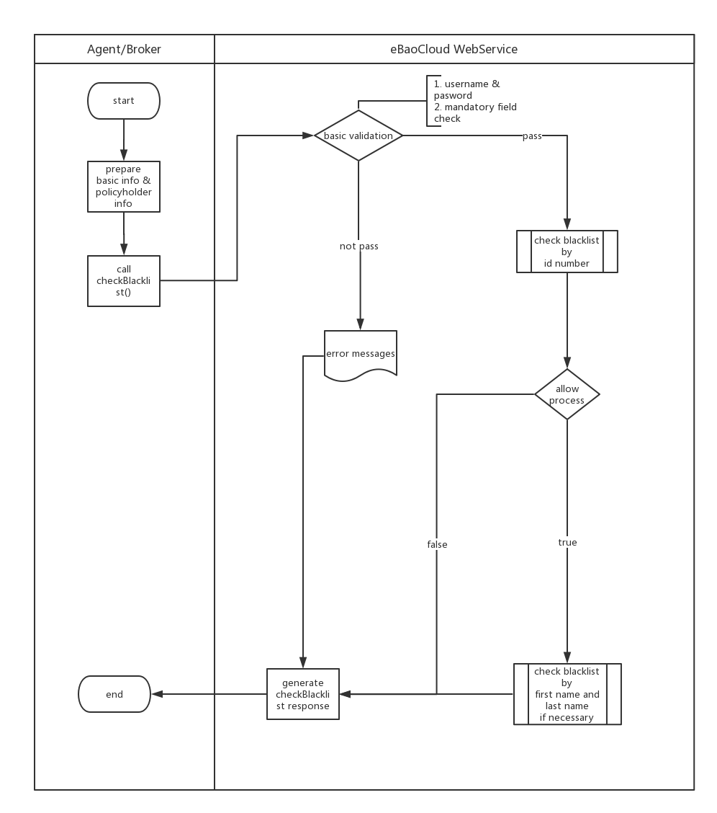

### Endpoint Address

[https://thuat.ebaocloud.com/gi/webservice/seg/misc?wsdl](https://thuat.ebaocloud.com/gi/webservice/seg/misc?wsdl)

#### CheckBlackList Method

- Business Logic



- Input Parameter

```xml
<soapenv:Envelope xmlns:soapenv="http://schemas.xmlsoap.org/soap/envelope/" xmlns:ser="http://service.segstd.ws.sp.gs.ebao.com/">
   <soapenv:Header/>
   <soapenv:Body>
      <ser:CheckBlackList>
         <username>1110127664</username>
         <password>eBao1234</password>
         <cardType>CI</cardType>
         <cardId>3100901528564</cardId>
         <firstName>leon</firstName>
         <lastName>luo</lastName>
      </ser:CheckBlackList>
   </soapenv:Body>
</soapenv:Envelope>
```

| Data Name | Type  | Optional |Sample | Description |
| --- | --- | :-: | :-: | :-: |
| username |String | M|1110127664 | |
| password |String | M|eBao1234 | |
| cardType |String | M|CI |Card type must be one of CI (ID card) and PI (Passport). |
| cardId |String | M|3100901528564 | id number |
| firstName |String |O |leon | |
| lastName |String | O|luo | |


- Return

```xml
<soap:Envelope xmlns:soap="http://schemas.xmlsoap.org/soap/envelope/">
   <soap:Body>
      <ns2:CheckBlackListResponse xmlns:ns2="http://service.segstd.ws.sp.gs.ebao.com/">
         <CheckBlacklistsResult>
            <IsSuccess>true</IsSuccess>
            <AllowProcess>false</AllowProcess>
            <Errors/>
         </CheckBlacklistsResult>
      </ns2:CheckBlackListResponse>
   </soap:Body>
</soap:Envelope>
```
| Data Name | Type  | Optional |Sample | Description |
| --- | --- | :-: | :-: | :-: |
| IsSuccess |Boolean | M| true | a flag indicates whether this transaction is succeed or failed|
| AllowProcess |Boolean | M| true | if allowProcess is false, this insured would be blocked.|
| Errors |Array | C| - | | |

