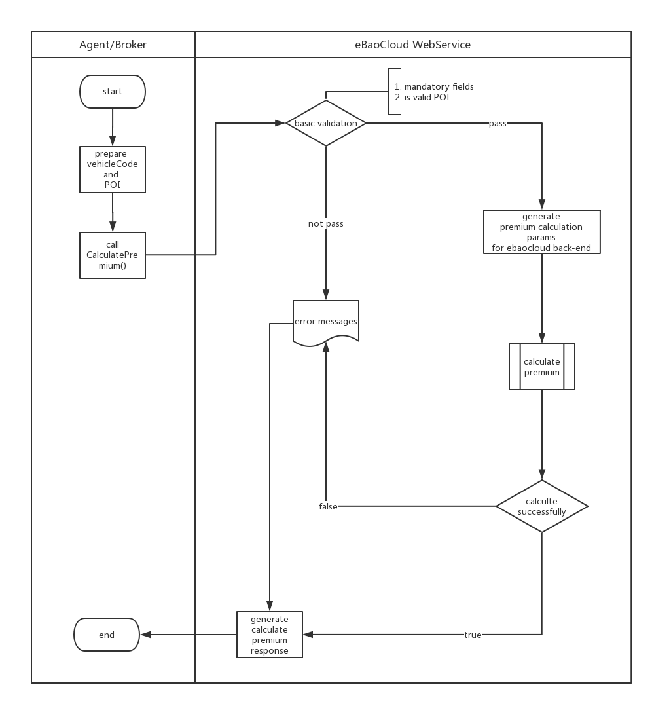

### Calculate Premium Method

- Business Logic



- Input Parameter

```xml
<soapenv:Envelope xmlns:soapenv="http://schemas.xmlsoap.org/soap/envelope/" xmlns:ser="http://service.segstd.ws.sp.gs.ebao.com/">
   <soapenv:Header/>
   <soapenv:Body>
      <ser:CalculatePremium>
         <carTypeCode>1.10</carTypeCode>
         <effectiveDate>20180528</effectiveDate>
         <expireDate>20190528</expireDate>
      </ser:CalculatePremium>
   </soapenv:Body>
</soapenv:Envelope>
```

| Data Name | Type | Optional | Sample | Description |
| --- | --- | :-: | :-: | :-: |
| CarTypeCode | String |  M| 1.10  | vehicle code such as 1.10 |
| EffectiveDate |String | M | 20180528 | |
| ExpireDate | String | M |20190528||

<span id="jump-to-cmi-response-desc"></span>

- Return

```xml
<soap:Envelope xmlns:soap="http://schemas.xmlsoap.org/soap/envelope/">
   <soap:Body>
      <ns2:CalculatePremiumResponse xmlns:ns2="http://service.segstd.ws.sp.gs.ebao.com/">
         <CalculatePremiumResult>
            <EffectiveDate>20180528</EffectiveDate>
            <ExpireDate>20190528</ExpireDate>
            <CoverDay>365</CoverDay>
            <FullPrm>600.0</FullPrm>
            <BillPrm>600.0</BillPrm>
            <BillVat>42.21</BillVat>
            <BillStamp>3.0</BillStamp>
            <BillPrice>645.21</BillPrice>
         </CalculatePremiumResult>
      </ns2:CalculatePremiumResponse>
   </soap:Body>
</soap:Envelope>
```

| Data Name | Type  | Sample | Description |
| --- | --- | :-: | :-: |
| EffectiveDate |String | 20180528 | |
| ExpireDate | String |20190528||
| CoverDay | String | 365  | the days of POI |
| FullPrm | String | 600.0  | Adjusted Gross Premum |
| BillPrm | String | 600.0  | Net Premium |
| BillVat | String | 42.21  | VAT |
| BillStamp | String | 3.0  | Stamp Duty |
| BillPrice | String | 645.21 | Actual Premium Payable |

