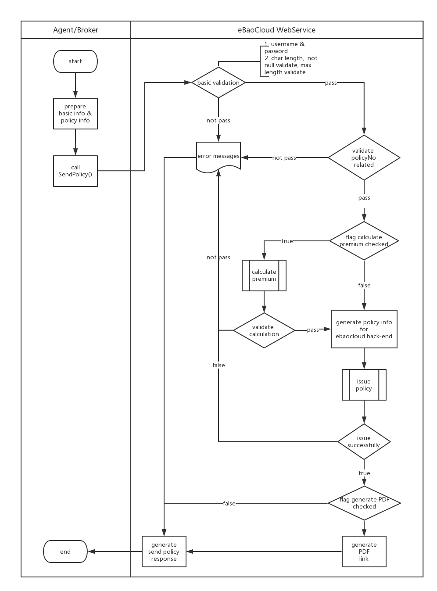

### SendPolicy Method


- Business Logic
 
 <span id="send-policy-business-logic"></span>



> Note

1. The user must ensure that the username is present in the system, the corresponding password is correct and the account is eligible for sale.

2. Required items can not be missing, for special fields have format requirements as well as the length of requirements.
    Otherwise eBaoCloud will return the following errors.

   - Require filed is missing. 
   ErrorCode=“4” 
   ErrorMessage like "Require field. Field name xxx is null or empty."

   - Validation Error.
   ErrorCode=“5” 
   ErrorMessage like "Validation Error. Field name xxx is xxx."

   - Master Data can not be found.
   ErrorCode=“7” 
   ErrorMessage like "DATA not found in Master Table. xxx"

   - Other Business Error from eBaoCloud back-end
   ErrorCode=“9999”
        
3. If you want to generate policyNo by yourself, you must inform eBaoCloud in advance and you will always generate policyNo for future use.

        
<br>

- Input Parameter

```xml
<soapenv:Envelope xmlns:soapenv="http://schemas.xmlsoap.org/soap/envelope/" 
  xmlns:ser="http://service.segstd.ws.sp.gs.ebao.com/">
  <soapenv:Header/>
  <soapenv:Body>
    <ser:SendPolicy>      
      <username></username>      
      <password></password>      
      <info>
        <PolNo/>
        <BarCode></BarCode>
        <TaxInvoiceNo/>
        <ReferenceNo/>
        <PreviousPolNo></PreviousPolNo>
        <CarTypeCode>1.10</CarTypeCode>
        <CarRegistNo>บฉ 5554</CarRegistNo>
        <CarChassisNo></CarChassisNo>
        <CarSeat/>
        <CarCC></CarCC>
        <CarWeight>14</CarWeight>
        <CarYear>2016</CarYear>
        <CarProvince>10</CarProvince>
        <CusPrefix>7</CusPrefix>
        <CusFname>haoran</CusFname>
        <CusLname>9wwwwwwwwww</CusLname>
        <CusSex/>
        <CusId>0000000000001</CusId>
        <CusType>C</CusType>
        <Email>leon.luo@ebaotech.com</Email>
        <PersonType/>
        <CoperateType>1</CoperateType>
        <CoperateBranchCode/>
        <PersonNationalityCode>THA</PersonNationalityCode>
        <Addrs1>Silom Complex</Addrs1>
        <CusTelNumber>021345678</CusTelNumber>
        <CusPostCode>10200</CusPostCode>
        <BillPrice>700</BillPrice>
        <BillStamp>3</BillStamp>
        <BillVat>42.21</BillVat>
        <BillPrm>645.21</BillPrm>
        <FullPrm>600</FullPrm>
        <EffectiveDate>20180530</EffectiveDate>
        <ExpireDate>20200530</ExpireDate>
        <CarBrandCode>AU01</CarBrandCode>
        <ProvinceCode>10</ProvinceCode>
        <DistrictCode>01</DistrictCode>
        <SubDistrictCode>01</SubDistrictCode>
        <PreferredLang></PreferredLang>
        <DirectDiscountRate></DirectDiscountRate>
        <DirectDiscountAmount></DirectDiscountAmount>
        <ISP14></ISP14>
      </info>
      <genaratePolNo>false</genaratePolNo>
      <genaratePDF>true</genaratePDF>
      <calculatePremium>true</calculatePremium>
    </ser:SendPolicy>
  </soapenv:Body>
</soapenv:Envelope>
```

<span id="jump-to-cmi-input-desc"></span>


| Data Name | Type | Length | Optional | Sample | Description |
| --- | --- | --- | :-: | :-: | :-: |
| username | String |  | M | 1110127664 |  |
| password | String |  | M | eBao1234 |  |
| genaratePolNo | Boolean |  | M | **true** | if brokers wants to maintain their own policy number, they have to tell eBaoCloud before they use it. Otherwise this value can only be true.|
| genaratePDF | Boolean |  | M | true | whether to return a link on issue success|
| calculatePremium | Boolean |  | M | true | if this field is true, FullPrm, BillPrice, BillStamp would be mandatory. |
| info | Object |  | M | - | table below |


| info | Type | Length | Optional | Sample | Description  |
| --- | --- | --- | --- | --- | --- |
|PolNo|String||C||
|BarCode|String||C||
|TaxInvoiceNo|String||C||
|ReferenceNo|String||O||
|PreviousPolNo|String||O||
| CarTypeCode | String |  | M | 1.10 | vehicle code such as 1.10, 1.20 |
| CarRegistNo | String |  | C | ui-9921 | plate number |
| CarChassisNo | String |  | M | HSDF12341234 |  |
| CarSeat | Integer |  | O | 4 | number of seat |
| CarCC | Integer |  | O | 1200 | capacity |
| CarWeight | Integer |  | O | 2000 | vehicle weight (kg)|
| CarYear | String |  | M | 2018 | vehicle registration year. if the year is not current year, carProvince and carRegistNo should be mandatory. if the year is current year, carProvince and carRegistNo are both empty, the vehicle will be set as a new vehicle. |
| CarProvince | String |  | C | 10 | vehicle registered province  |
| CusPrefix | String |  | C | 7 |  |
| CusFname | String |  | M | leon | policyholder first name |
| CusLname | String |  | C | luo | policyholder last name |
| CusId | String |  | C | 3643645645454545 |policyholder IC or Passport Number |
| CusType | String |  | M | P | policyholder person type. It must be one of P,C,N. |
| Email | String |  | O | leon.luo@ebaotech.com |  policyholder email address|
| CoperateType | Integer |  | C | 1 |  |
| CoperateBranchCode | String |  | C | 00000 | It should be a mandatory filed when CoperateType is 2. |
| PersonNationalityCode | String |  | M | THA | policyholder nationality |
| Addrs1 | String |  | M | Silom Complex | address line |
| CusTelNumber | String |  | O | 0978166121 | mobile or phone number |
| CusPostCode | String |  | O | 10200 |  |
| BillPrice | Decimal |  | C | 700 |  |
| BillStamp | Decimal |  | C | 3 |  |
| BillVat | Decimal |  | C | 42.21 |  |
| BillPrm | Decimal |  | C | 645.21 |  |
| FullPrm | Decimal |  | C | 600 |  |
| EffectiveDate | String |  | M | 20180530 |  |
| ExpireDate | String |  | M | 20190530 |  |
| CarBrandCode | String |  | M | AU01 | make code |
| ProvinceCode | String |  | M | 13 |  |
| DistrictCode | String |  | M | 01 |   |
| SubDistrictCode | String |  | M | 01  |  |
| PreferredLang| String | | O | en_US| this value should be one of en_US and th_TH |
| DirectDiscountRate | String | | O | 0.18 |  |
| DirectDiscountAmount | String | | O | 800 | It must exist at the same time as DirectDiscountRate |
| ISP14 | String | | O |  | ReconcileFile |


- Return

```xml
<soap:Envelope xmlns:soap="http://schemas.xmlsoap.org/soap/envelope/">
   <soap:Body>
      <ns2:SendPolicyResponse xmlns:ns2="http://service.segstd.ws.sp.gs.ebao.com/">
         <SendPolicyResult>
            <IsSuccess>true</IsSuccess>
            <PolNo>NCMI9000003140</PolNo>
            <BillPrm>600.00</BillPrm>
            <BillStamp>3</BillStamp>
            <BillVat>42.21</BillVat>
            <BillPrice>645.21</BillPrice>
            <TablePDF>https://thtst.ebaocloud.com/gi/api/std/b2b/policies/print/allinone/1280906159</TablePDF>
            <Errors/>
         </SendPolicyResult>
      </ns2:SendPolicyResponse>
   </soap:Body>
</soap:Envelope>
```

<span id='jump-to-cmi-resp-desc'></span>

| Data Name | Type | Optional | Sample | Description |
| --- | --- | :-: | :-: | :-: |
| IsSuccess | Boolean | M | true | - |
| PolNo | String | C | NCMI9000003143 | - |
| BillPrm | Decimal | C | 600.00  | - |
| BillStamp | Decimal | C | 3 | - |
| BillVat | Decimal | C | 42.21  | - |
| BillPrice | Decimal | C | 645.21 | - |
| TablePDF | String | C | https://thtst.ebaocloud.com/gi/api/std/b2b/policies/print/allinone/1280906159  | PDF download link |
| Errors | Array | C | - | Only when 'isSuccess' is false, it will contain elements. See Error Object as below.|

| Error | Type |  Sample |
| --- | --- | --- |
| ErrorCode |String  | 4 |
| ErrorMessage  |String  | Require field. Field name CusLName is null or empty.|


>Note

For column "Optional", "M" means "Mandatory"; "O" means "Optional", and "C" means "Conditional".

